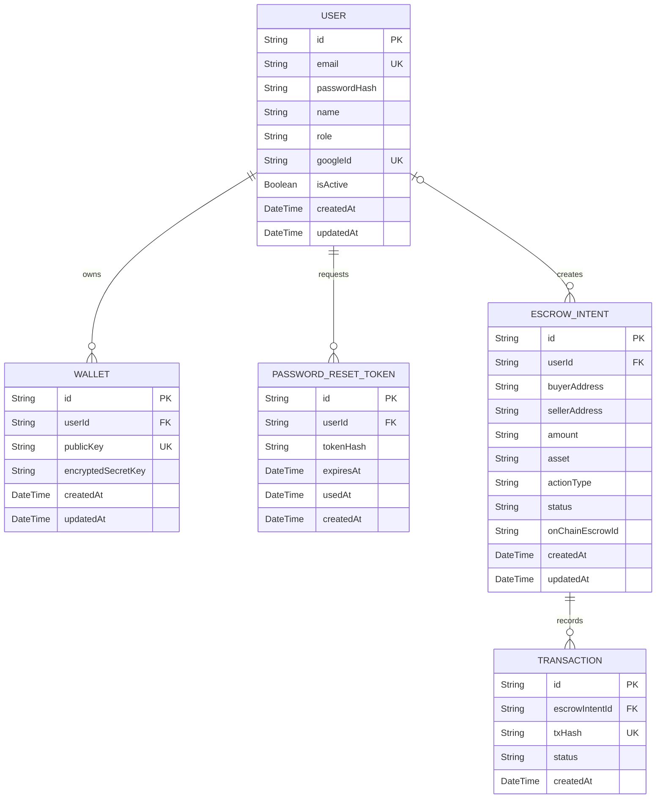

# Database Schema and ERD

This document describes the relational schema behind the **PadiPay Stellar Relayer API**, defined in [`prisma/schema.prisma`](../prisma/schema.prisma).

It provides an Entity Relationship Diagram (ERD) alongside a written explanation of each model, its uniqueness constraints, and its cascading delete behavior, so new contributors can understand how `User`, `Wallet`, and `EscrowIntent` relate to one another without reading the raw schema first.

> **Note**
>
> This document reflects the schema as committed. If a future migration changes a model, a field, or a relation, update this document in the same pull request so it never drifts from `schema.prisma`.

# Entity Relationship Diagram

`PK` marks a primary key, `FK` a foreign key, and `UK` a field with a unique constraint. Mermaid's `||` marks the "exactly one" side of a relationship and `o|` marks "zero or one"; `o{` marks "zero or many" on the other side. Reading `USER ||--o{ WALLET`, for example: every `Wallet` belongs to **exactly one** `User`, and a `User` owns **zero or more** `Wallet` rows.

# Relationship Summary

| Parent | Child | Cardinality | Foreign Key | `onDelete` |
|---|---|---|---|---|
| `User` | `Wallet` | 1:N | `Wallet.userId` (required) | `Cascade` |
| `User` | `PasswordResetToken` | 1:N | `PasswordResetToken.userId` (required) | `Cascade` |
| `User` | `EscrowIntent` | 1:N, optional | `EscrowIntent.userId` (nullable) | `SetNull` |
| `EscrowIntent` | `Transaction` | 1:N | `Transaction.escrowIntentId` (required) | `Cascade` |

Every relationship currently defined in `schema.prisma` is one-to-many (1:N) from the parent's perspective. There is no one-to-one (1:1) relationship in the schema today — no relation field carries a `@unique` (or `@@unique`) constraint on its foreign key, which is what would turn a 1:N relation into a 1:1 one (e.g. if `Wallet.userId` were unique, each `User` could only ever own a single `Wallet`). If a future change introduces one, add it to this table and to the diagram above using Mermaid's `||--||` notation.

# Model Reference

## User

The account holder. Authenticates with either an email/password pair or a Google account, and owns wallets and escrow intents.

* `email` is unique — no two users can share the same email.
* `googleId` is unique when present — enforces at most one `User` row per linked Google account.
* `role` defaults to `"USER"` and is a plain string rather than a Prisma `enum`, so valid values are enforced at the application layer, not the database layer.
* `isActive` defaults to `true`; deactivating a user is a soft state, not a delete.

## Wallet

A Stellar keypair custodied by the relayer on a user's behalf.

* `publicKey` is unique — the same Stellar public key cannot be registered as more than one `Wallet` row, even across different users.
* `encryptedSecretKey` stores the wallet's secret key at rest in encrypted form; see the [Security Guidelines](./contributing.md#security-guidelines) — this field must never be logged or returned in an API response.
* Deleting a `User` cascades to delete all of that user's `Wallet` rows (`onDelete: Cascade`). A wallet cannot outlive the user that owns it.

## PasswordResetToken

A one-time-use token issued to let a user reset a forgotten password.

* `tokenHash` stores a hash of the reset token, never the raw token itself.
* `usedAt` is nullable and is set once the token has been redeemed, so a token can be checked for reuse without a separate table.
* Indexed on both `tokenHash` (fast lookup when a reset link is opened) and `userId` (fast lookup of a user's outstanding tokens).
* Deleting a `User` cascades to delete all of that user's `PasswordResetToken` rows (`onDelete: Cascade`).

## EscrowIntent

A record of an escrow action a user has requested — for example, creating or releasing an on-chain escrow.

* `userId` is **nullable**, unlike every other foreign key in this schema. An `EscrowIntent` can exist without an owning `User`.
* Deleting a `User` does **not** delete their escrow intents. Instead, `onDelete: SetNull` clears `EscrowIntent.userId` to `null`, preserving the escrow and transaction history for audit purposes even after the originating account is removed.
* `actionType` defaults to `"CREATE"` and `status` defaults to `"PENDING"`; both are plain strings validated at the application layer (see [Validate Every External Input](./contributing.md#validate-every-external-input)).
* `onChainEscrowId` is populated once the intent has been submitted and confirmed on-chain, linking the off-chain record to its on-chain counterpart.

## Transaction

A single submitted Stellar transaction associated with an `EscrowIntent`. An escrow intent can require more than one transaction over its lifecycle (for example, a retry after a failed submission), which is why this is a separate 1:N model rather than a field on `EscrowIntent`.

* `txHash` is unique — the same Stellar transaction hash cannot be recorded twice.
* Deleting an `EscrowIntent` cascades to delete all of its `Transaction` rows (`onDelete: Cascade`). A transaction record cannot outlive the escrow intent it belongs to.

# Uniqueness Constraints

| Model | Field | Constraint |
|---|---|---|
| `User` | `email` | `@unique` |
| `User` | `googleId` | `@unique` (nullable — multiple `null` values are allowed) |
| `Wallet` | `publicKey` | `@unique` |
| `Transaction` | `txHash` | `@unique` |

No composite (`@@unique`) constraints are defined in the current schema — every uniqueness rule applies to a single column.

# Cascading Behavior

Two distinct delete strategies are used, deliberately:

* **`Cascade`** (`Wallet`, `PasswordResetToken`, `Transaction`) — child rows are meaningless without their parent, so removing the parent removes them too. A wallet, a password reset token, and a transaction record all only make sense in the context of the account or escrow intent that produced them.
* **`SetNull`** (`EscrowIntent.userId`) — an escrow intent, and its associated on-chain transaction history, is treated as durable financial record-keeping that must survive the deletion of the originating `User` account. Deleting a user unlinks their escrow intents rather than destroying them.

When adding a new relation, choose the strategy deliberately based on whether the child record has value independent of its parent, and document the choice here.

# Repository Documentation

For detailed information on how this schema fits into the wider system, please see our documentation hub:

- [Architecture & The Relayer Pattern](./architecture.md)
- [API Documentation](./api.md)
- [Setup Guide](./setup-guide.md)
- [Contributing Guidelines](./contributing.md)
